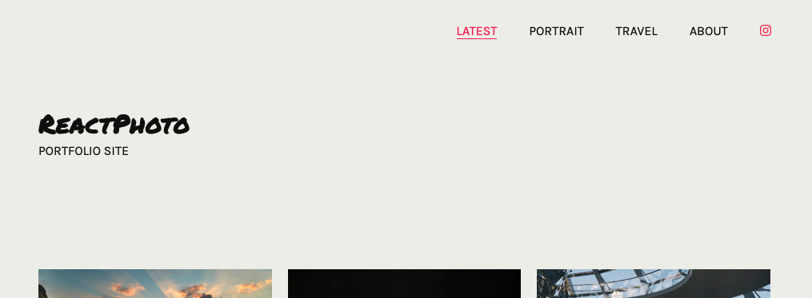

# ReactPhoto

A simple site builder, informed by file structure.

It's my hope that this static site builder will make it painless for photographers looking to build a simple, elegant portfolio to publish their work online.

This project was bootstrapped with [Create React App](https://github.com/facebook/create-react-app).

## Getting started

Grab this project and install dependencies using npm.

Firstly, you'll need to create a new folder in the root of this project called ``photography``. This folder, and its subfolders/files will create your site structure.

Any files in ``photography`` root will be ignored. Any folders will create top-level-navigation, and their children and subfolders will create subnavigation and pages.

Navigation and URLs are generated from folder and file names.

### Photo metadata

You can use IPTC metadata to overwrite a photo's page title (using the ``Headline`` field), and add caption text.

Currently supported attributes are:

- Headline
- Caption

In future, there will be configurable support for EXIF data, including location and camera details.

### Site configuration

You can edit the ``config`` file in ``src/data/config.json`` to customise your information - including site title, author and social media info.

To change the site colors, you can edit the ``mixins`` file in ``src/styles/_mixins.scss``. If you like, you can supply hex values or use your own variables here. 

Please note, there is a light (default) and dark theme, and your own color values should contrast sufficiently for legibility.

You should also update the markup in the ``About`` page, via ``src/views/about/About.jsx``, supplying your own image and description text here.

## Available Scripts

In the project directory, you can run:

### 'yarn setup'

Run this to create your data file, and export your photos for use with the application. This will generate the required thumbnails and extract metadata if available.

If you don't successfully complete the initial setup, the application will not build correctly.

### `yarn start`

Runs the app in the development mode. 
Open [http://localhost:3000](http://localhost:3000) to view it in the browser.

The page will reload if you make edits. 
You will also see any lint errors in the console.

### `yarn test`

Launches the test runner in the interactive watch mode. 
See the section about [running tests](https://facebook.github.io/create-react-app/docs/running-tests) for more information.

### `yarn build`

Builds the app for production to the `build` folder. 
It correctly bundles React in production mode and optimizes the build for the best performance.

The build is minified and the filenames include the hashes. 
Your app is ready to be deployed!

See the section about [deployment](https://facebook.github.io/create-react-app/docs/deployment) for more information.

## Learn More

You can learn more in the [Create React App documentation](https://facebook.github.io/create-react-app/docs/getting-started).

To learn React, check out the [React documentation](https://reactjs.org/).
