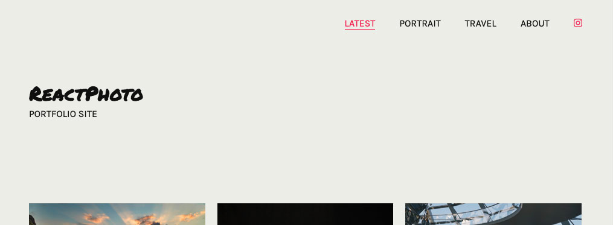

A simple site builder, informed by file structure.

It's my hope that this static site builder will make it painless for photographers looking to build a simple, elegant portfolio to publish their work online.

<!--  -->

## Features

### Easy setup

Following the guide below, which requires very little coding knowledge. Simply add your own folders/subfolders and photos to create your site structure, then run the required npm commands to build your site.

### Designed for mobile

Using the best responsive design practices, the site helps your photos look their best whether on mobile or widescreen. Using masonry, the layout adjusts dynamically to fit your images.

### Utilize metadata

To avoid writing the same copy, many times over, **ReactPhoto** will extract EXIF/IPTC information which is commonly added during the post-processing stage, meaning all of your information can be stored in the image file itself.

### Dark theme

Includes light and dark color themes, which adjust automatically based on site visitor preferences.

## Demo

ReactPhoto is currently being used to power [my own photo site, bryPhoto](https://www.bryphoto.co.uk/). I will keep this updated as development continues.

This project was bootstrapped with [Create React App](https://github.com/facebook/create-react-app).

## Getting started

Grab this project and install dependencies using [Node Package Manager](https://docs.npmjs.com/about-npm/index.html).

Firstly, you'll need to create a new folder in the root of this project called ``photography``. This folder, and its subfolders/files will create your site structure.

Any files in ``photography`` root will be ignored. Any folders will create top-level-navigation, and their children and subfolders will create subnavigation and pages.

Navigation and URLs are generated from folder and file names.

### Photo metadata

You can use IPTC metadata to overwrite a photo's page title (using the ``Headline`` field), and add caption text.

Currently supported attributes are:

- Headline
- Caption

In future, there will be configurable support for EXIF data, including location and camera details.

### Site configuration

You can edit the ``config`` file in ``src/data/config.json`` to customise your information - including site title, author and social media info.

To change the site colors, you can edit the ``mixins`` file in ``src/styles/_mixins.scss``. If you like, you can supply hex values or use your own variables here. 

Please note, there is a light (default) and dark theme, and your own color values should contrast sufficiently for legibility.

You should also update the markup in the ``About`` page, via ``src/views/about/About.jsx``, supplying your own image and description text here.

